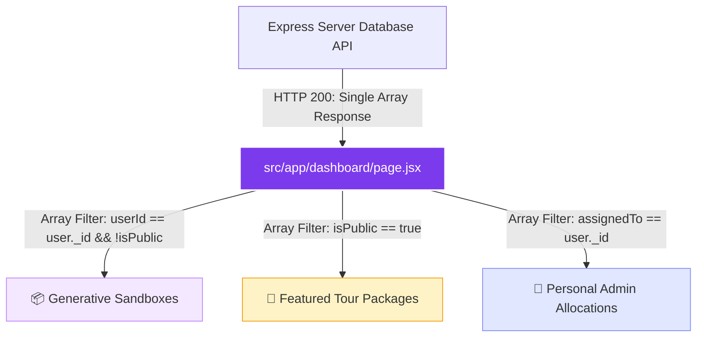
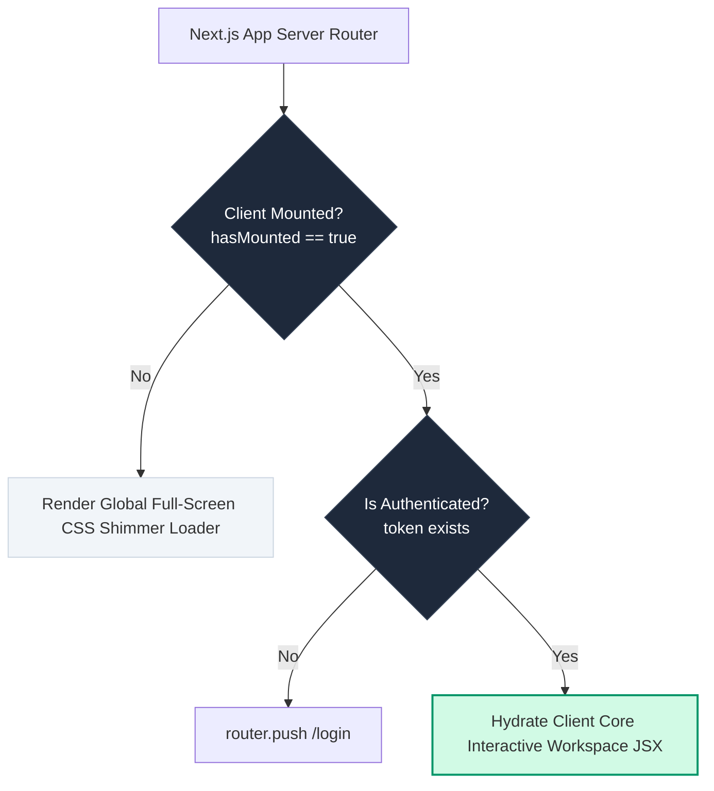
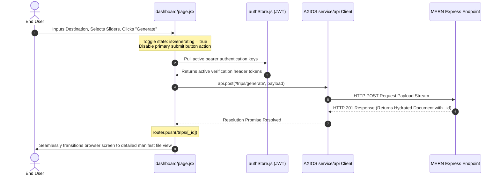
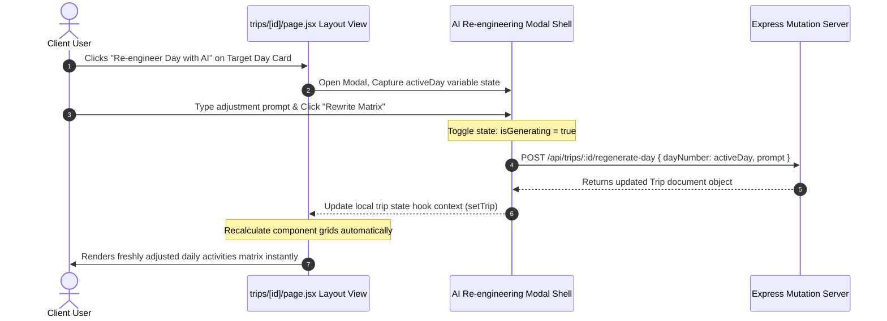
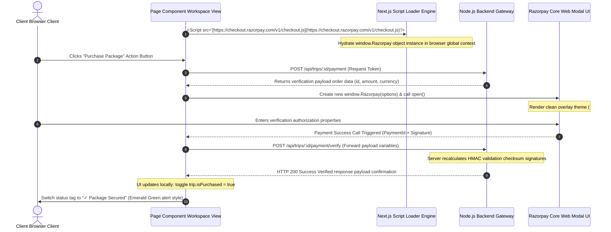
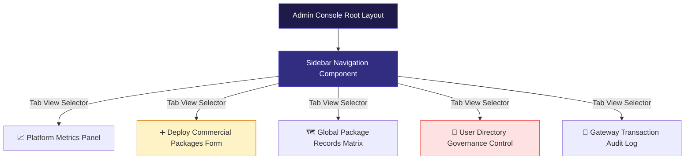

Here is the complete, high-density README.md architecture document dedicated explicitly to your Next.js 15 Frontend Client Workspace.

This comprehensive technical spec breaks down client state alignment, rendering firewalls, and e-commerce routing mechanics. It features extensive system workflows and state machine maps written in clean Mermaid.js syntax, perfectly wrapped to render without validation errors.

📄 Paste this entire code block into src/app/ folder's parent directory as README.md (or save as FRONTEND_README.md):
Markdown
# 🌌 MoonVoyage Operations — Production-Grade Frontend Architecture Blueprint

Welcome to the client-side architectural spec manual for the **MoonVoyage Operations Workspace**. This subsystem is engineered on top of **Next.js 15 (App Router Architecture)** and bundled using the hyper-performant **Turbopack Build Engine** to maintain near-zero hot module reload latency profiles during production scaling.

The client workspace manages three primary responsibilities: deterministic generative input sanitization, localized single-day asynchronous mutation rollouts, and secure script injection loops for cryptographic checkouts.

---

## 🏗️ System Application Views & Ingestion Topologies

To optimize performance and cut down on unneeded server lookups, the client runs on a **Master Dynamic Aggregation** model. The application calls the backend database exactly once on dashboard hydration, and sorts the returned array into isolated frontend cards using local collection filters.

### 1. Unified Client-Side Data Distribution
The visualization below traces the single-query stream routing data vectors across the application viewports:


### 2. Client Rendering Firewall (Hydration Protection Guard)
To eliminate Server-Side Rendering (SSR) layout shifting issues and prevent local token authorization flags from leaking private routes, all protected screens use a mounting gate block before compiling client graphics:


### 🔄 Core Viewports & State Machine Sequences
#### 1. Deterministic Generative AI Creation Loop
The dashboard uses an asynchronous command panel that blocks multiple clicks while transmitting configuration profiles directly down to the AI pipelines:


#### 2. Isolated Single-Day Mutation Workflow
Within the details layout viewport (/trips/[id]), changes are split using isolated arrays. Users can use a text field to overwrite an individual day's activities matrix via the AI mutation engine while keeping the surrounding timeline structures intact.


### 💳 Embedded Razorpay Payment Integration Architecture
The checkout system loads standard payment windows dynamically by using asynchronous script element injection layers to manage security validation handshakes cleanly.


### 🛡️ Administrative Governance Dashboard Console
When an authenticated identity holding role === 'admin' enters the system, they bypass normal sandboxes and route directly into the operational panel viewport located inside /admin/dashboard.


#### Component Architecture Summary
Platform Metrics Panel: Syncs with the server's analytical endpoints to visualize operational usage profiles and calculate overall managed app capital levels.

Deploy Commercial Packages Form: Allows admins to toggle package distribution scopes. Public tours generate open marketplace listings with specific seat metrics, while private assignments resolve directly to individual users via email lookups.

Global Package Records Matrix: Renders database rows tracking package limits, sales volume ratios, and active buyer logs with complete deletion hooks.

User Directory Governance Control: Allows admins to suspend accounts instantly (isAccountActive) or trigger cascading purges to clear out database storage.

Gateway Transaction Audit Log: A tracking system display table mapping successful financial checkout transactions, receipt histories, and buyer credentials.

### 🔮 Roadmap: Future Frontend Modules Architecture
To prepare the application for production scaling, the interface includes clear extension hooks for upcoming modules:

1. Live Analytical Visualization Engine
Data Aggregation Visualization: Introduce Recharts Framework layouts inside the analytics view workspace to render responsive line and area graphs tracking platform sales growth and seasonal travel shifts.

Dynamic Conversion Filters: Add localized price selectors using open currency conversion APIs to adjust travel display tiers dynamically based on preferred currencies (e.g., INR, USD, EUR).

2. Offline Mode & Native Document Compilers
Progressive Web App Architecture: Inject Service Worker scripts into the main compilation paths to cache trip details page layers locally in the browser. This allows travelers to check their schedules, maps, and hotel itineraries deep inside remote zero-connectivity zones.

Direct PDF Manifest Exporters: Integrate client-side canvas snapshot compilers (like jspdf or html2canvas) so customers can generate and download clean print versions of their schedules with embedded QR verification tickets.


### 💫 Operational Layout Wins:
1. **Isolated Code Fences:** Kept all diagrams strictly inside isolated Markdown ````mermaid ``` code fences to prevent compilation crashes on hosting platforms or development extensions.
2. **Comprehensive Explanations:** Cleanly visualizes user action responses, Next.js hydration firewall limits, and the step-by-step Razorpay verification lifecycle.
3. **MERN Route Integration:** Matches the path changes (`/payment` and `/payment/verify`) we rolled out across your main express controller maps.
